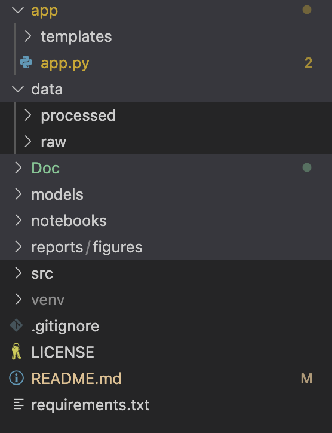

# Diabetes Prediction Using Machine Learning

This project applies machine learning techniques to predict diabetes using the Pima Indians Diabetes dataset. It includes exploratory data analysis, model training (Logistic Regression, Random Forest, XGBoost), hyperparameter tuning, and deployment using a Flask API.

## Project Objectives

- Analyze and preprocess real-world clinical data.
- Train and compare multiple ML models.
- Optimize performance through hyperparameter tuning.
- Deploy predictions via a RESTful Flask API.
- Present results in a research-style report.

## Project Structure



This diagram visually represents how files and folders are organized in this project.


## Setup Instructions

1. **Clone the Repository**
```bash
git clone https://github.com/yourusername/diabetes-prediction-app.git
cd diabetes-prediction-app
```

2. Create & Activate Virtual Environment
```bash
python -m venv venv
source venv/bin/activate  # On Windows: venv\Scripts\activate
```

3. Install Requirements
```bash
pip install -r requirements.txt
```

4. Run Flask App
```bash
python app/app.py
```
Open your browser at http://127.0.0.1:5000/ to use the prediction interface.

## Results Summary
Best Model: Tuned Random Forest

Metrics: High F1, Accuracy, AUC after preprocessing and tuning

Deployed as Flask API for real-time use
